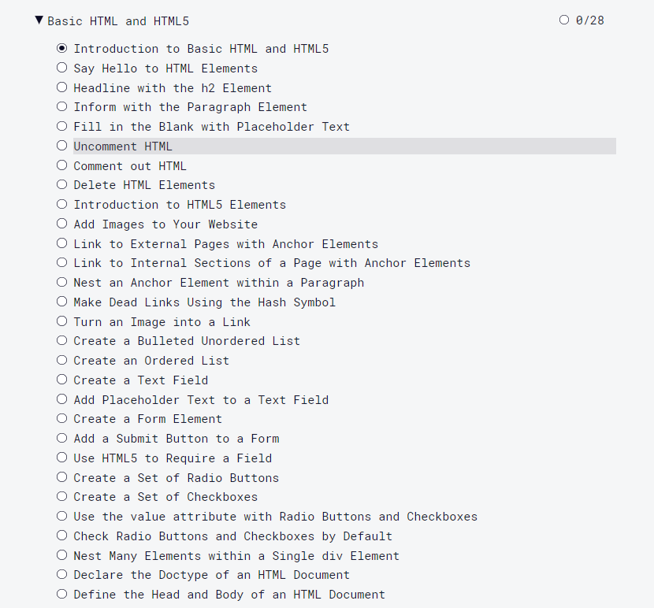
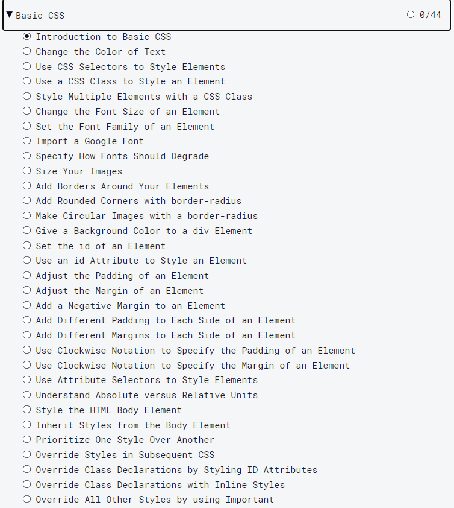

# Episode 0 Pre-requisite
Welcome everyone! Each one of you who has registered for upcoming SAPUI5 & Fiori for ABAPer's series has already taken the first step that we want to learn and learn together. Working in SAPUI5 has its on learning curve and together we will experience it. This upcoming series will cover the basic's and slowly move into the advanced stuff. 

We will be sending assignment also after every stream so that you can practice what we have learnt. So as a first step it make sense to subscribe to our  [Technology Enthusiasts](https://www.youtube.com/channel/UCW8OSu54ONLbsdV30tB3sKQ) channel so that you are up to date with upcoming sessions/talks etc. 

**PS: All mentioned pre-requiste are FREE, Everything mentioned will be FREE as Education is Free:)**

## What are the Pre-requistes?
Starting SAPUI5 directly will be a mistake for anyone who does not understand the working of world wide web, how websites load or how they work in the way using what technology. I am saying this because an ABAPEr has spent most of his/her time in SE38/SE80// with limited understanding of these concepts. I am not saying all but many. So I would request you kindly make sure you have done all the pre-requisite before you attend sessions otherwise it get's tough.
- [Understanding HTML/HTML5](#html)
> It is very important to have basic understanding how things are structured when a website load. So request you to kindly do the same by completing below mentioned training at [Freecodecamp](https://www.freecodecamp.org/learn)

- [Understanding CSS](#CSS)
> Once you are done with HTML understanding it makes sense to move to next level which is to beautify your document or site or page. So once you have covered [HTML](#html) then cover the CSS by completing  training at [Freecodecamp](https://www.freecodecamp.org/learn)

- [Understanding Javascript](#JS)
> Now we understand  HTML/CSS it makes sense to understand how do we make our pages/sites etc dynamic. So watch the complete playlist [here](https://www.youtube.com/watch?v=lOAyyyj1KNc&list=PLFPD0TdUpypnX-9BkIrE9pODPv90nYacT)

## Further Readings
For further reading we suggest the following
- [You don't know JS](https://github.com/getify/You-Dont-Know-JS)
- [w3schools.com](https://www.w3schools.com/js/default.asp)
